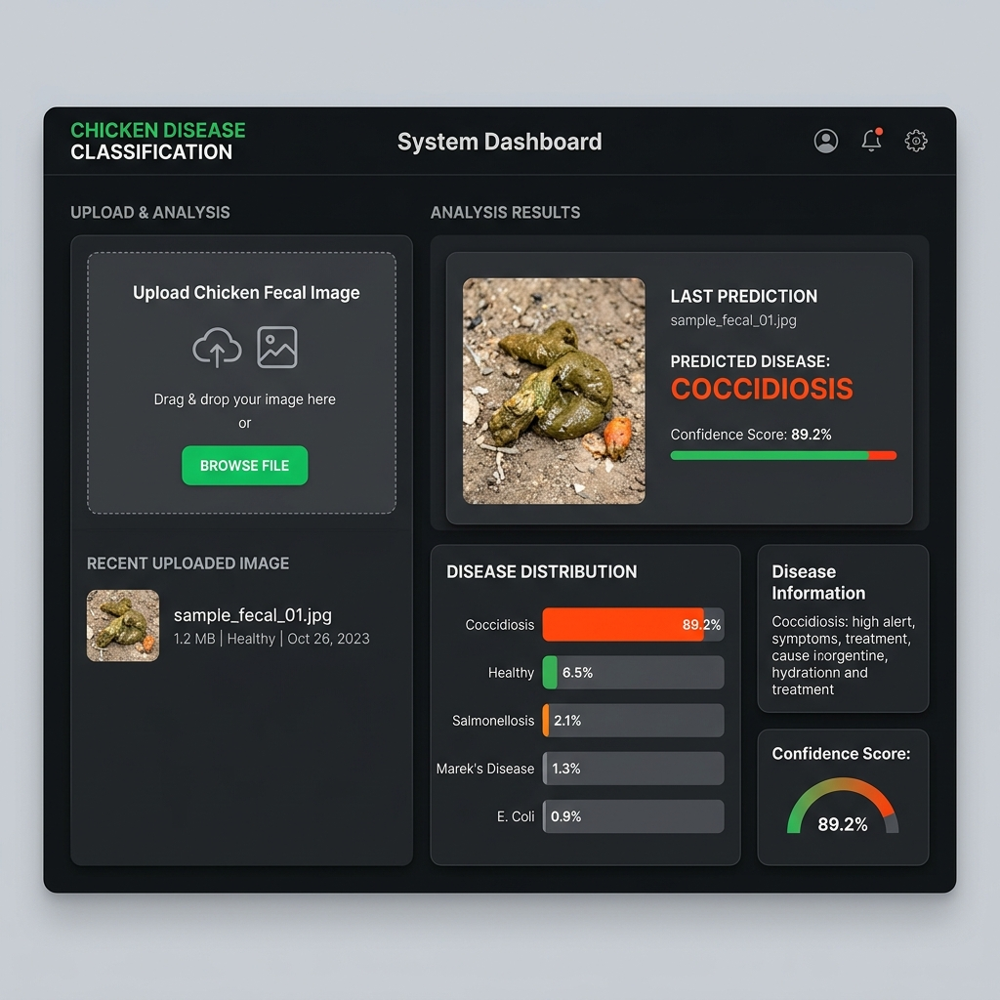

# Chicken Disease Classification

End-to-end deep learning classification system with automated DVC pipelines, CI/CD, and cloud deployment. This project aims to accurately classify chicken diseases (like Coccidiosis) from fecal images using a Convolutional Neural Network (CNN) built with TensorFlow and Keras.

## User Interface


*A clean, modern web interface for the Chicken Disease Classification system.*

## Tech Stack

- **Machine Learning**: TensorFlow, Keras, Numpy, Pandas
- **Web Framework**: Flask, Flask-CORS
- **Frontend**: HTML, CSS, JS
- **Pipeline & MLOps**: DVC (Data Version Control)
- **Visualization**: Matplotlib, Seaborn
- **CI/CD & Deployment**: GitHub Actions (Configurations for AWS/Azure available)

## Workflow

1. Update `config.yaml`
2. Update `secrets.yaml` [Optional]
3. Update `params.yaml`
4. Update the entity
5. Update the configuration manager in `src/config`
6. Update the components
7. Update the pipeline
8. Update `main.py`
9. Update `dvc.yaml`
10. `app.py`

## How to Run

### Step 1: Clone the repository
```bash
git clone https://github.com/manishkr6/chicken-disease-classification.git
cd chicken-disease-classification
```

### Step 2: Create a virtual environment
```bash
python3 -m venv .venv
source .venv/bin/activate
```

### Step 3: Install dependencies
```bash
pip install -r requirements.txt
```

### Step 4: Run DVC Pipeline
To reproduce the data processing, model training, and evaluation pipeline:
```bash
dvc repro
```
*Note: This will execute the stages defined in `dvc.yaml` (Data Ingestion -> Prepare Base Model -> Training -> Evaluation).*

### Step 5: Start the web application
```bash
python app.py
```
Open your browser and navigate to `http://localhost:8080`. You can upload an image, click 'Predict', and get the disease classification results.

## Model Training Parameters

Configured via `params.yaml`:
- **Image Size**: 224x224x3
- **Batch Size**: 15
- **Epochs**: 9
- **Classes**: 2 (e.g., Coccidiosis, Healthy)
- **Learning Rate**: 0.001
- **Base Model Weights**: ImageNet

## License

This project is licensed under the MIT License. See the [LICENSE](LICENSE) file for details.
